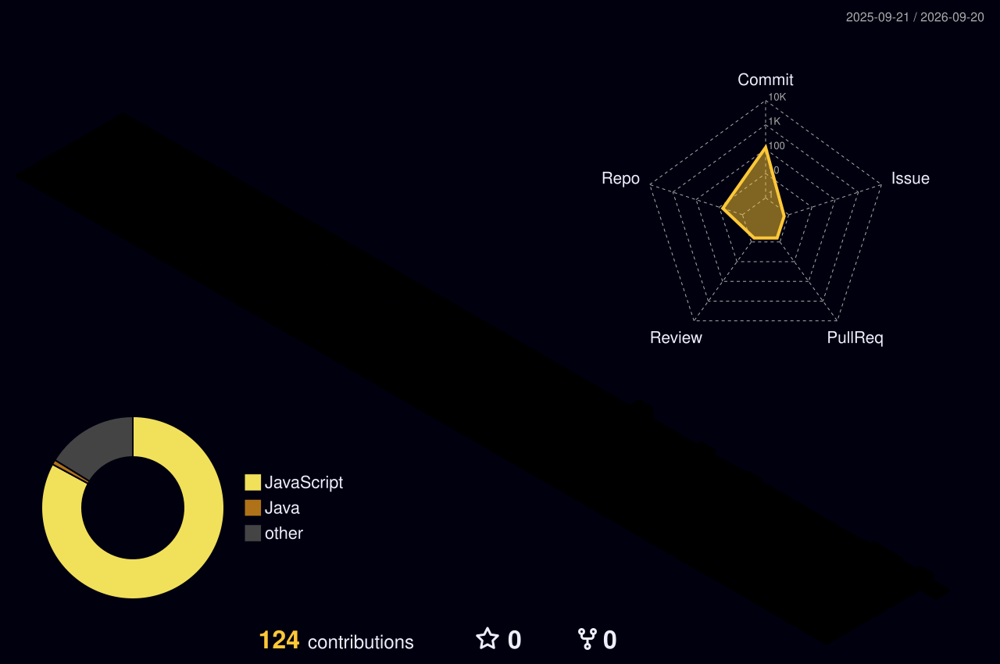

<!-- PREMIUM HERO SECTION -->
 

  <b>Architecting scalable web applications and AI-powered solutions.</b> 
  Currently studying Computer Engineering • Based in Maharashtra, India

  
  
  

 

  

<!-- COMPACT EXPERTISE GRID -->
<table width="800">
  <tr>
    <td align="center" width="33%">
      <h3>🌐 Full Stack</h3>
      
React • Next.js • Spring Boot

    </td>
    <td align="center" width="33%">
      <h3>🧠 AI & ML</h3>
      
Python • TensorFlow • Computer Vision

    </td>
    <td align="center" width="33%">
      <h3>☁️ Cloud</h3>
      
AWS (EC2, RDS, S3) • Docker

    </td>
  </tr>
</table>

 

<!-- FLAGSHIP PROJECT (SAAS DASHBOARD STYLE) -->
<h3 align="left">🚀 FLAGSHIP PROJECT</h3>
<table width="800">
  <tr>
    <td colspan="2" align="center" bgcolor="#0D1117">
       
      <h2>🍎 FOOD NUTRITION & CALORIE DETECTION</h2>
      
<kbd>✓ SYSTEM ACTIVE</kbd> &nbsp;|&nbsp; <b>AI + FULL STACK + CLOUD</b>

       
    </td>
  </tr>
  <tr>
    <td width="55%" valign="top" bgcolor="#0D1117">
      <blockquote>
        An AI-powered web application that analyzes food images, recognizes the food, and estimates calorie and nutritional information.
      </blockquote>
      
<b>Core Capabilities:</b>

      <ul>
        <li>Deep Learning food recognition</li>
        <li>Automated nutritional estimation</li>
        <li>Interactive user history dashboard</li>
      </ul>
       
    </td>
    <td width="45%" valign="top" align="center" bgcolor="#0D1117">
      
<b>Infrastructure:</b>

      <code>React</code> → <code>Spring Boot</code> → <code>TensorFlow</code>  
        
      
      
        
    </td>
  </tr>
</table>

 

<!-- SECONDARY PROJECTS GRID -->
<h3 align="left">📂 OTHER ENGINEERING WORK</h3>
<table width="800">
  <tr>
    <td width="33%" valign="top">
      <b>🛒 Gawad Electronics</b> 
      Next.js • Tailwind CSS 
      
Modern e-commerce storefront with a seamless shopping experience and responsive UI.

      <a href="#"><code>[ Source ↗ ]</code></a>
    </td>
    <td width="33%" valign="top">
      <b>⚛️ React Interfaces</b> 
      React • JS • CSS 
      
A collection of interactive frontend applications focusing on state management and UI.

      <a href="#"><code>[ Source ↗ ]</code></a>
    </td>
    <td width="33%" valign="top">
      <b>☕ Core Systems & DSA</b> 
      Java • Algorithms 
      
Object-oriented principles and optimized data structure implementations.

      <a href="#"><code>[ Source ↗ ]</code></a>
    </td>
  </tr>
</table>

 

<!-- TECH STACK DOCK -->
<h3 align="left">⚡ TECHNOLOGY STACK</h3>
<blockquote>
  

    
  

</blockquote>

 

<!-- UPGRADED DEVELOPER CONSOLE -->
<h3 align="left">📊 TELEMETRY & ACTIVITY</h3>
<table width="800">
  <tr>
    <td colspan="2" align="center" bgcolor="#0D1117">
       
      <!-- Option 2: 3D Isometric Contribution Graph -->
      
        
    </td>
  </tr>
  <tr>
    <td width="50%" align="center" valign="top" bgcolor="#0D1117">
       
      
<code>[ BUILDING ]</code> <code>[ LEARNING ]</code> <code>[ SHIPPING ]</code>

      
      
        
    </td>
    <td width="50%" align="center" valign="top" bgcolor="#0D1117">
       
      <b>Focus Areas (2026)</b> 
      • Master Full Stack Architecture 
      • Cloud Deployments (AWS) 
      • Production-Grade Projects
        
    </td>
  </tr>
</table>

  

 

  <a href="https://github.com/YashGawad">`GitHub`</a> &nbsp;•&nbsp; <a href="https://www.linkedin.com/in/yash-gawad-638189363">`LinkedIn`</a> &nbsp;•&nbsp; <a href="mailto:your-email@example.com">`Email`</a>

Built with curiosity, code, and coffee ☕

